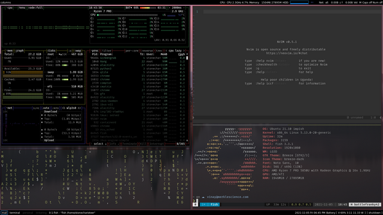

======================
pystonecharioteer
======================

This is a helper module that I'm maintaining for my own utils and configs.
At the outset, I'm using this to maintain my :code:`qtile` config.

------------------
Installation
------------------

Create a virtual environment, preferably in ``/opt/qtile/``, and run

.. code:: bash

    pip install stonecharioteer

Next, create an xsession file (``/usr/share/xsessions/qtile.desktop``) so that this is recognized in your display manager
(I use sddm).

.. code::

   [Desktop Entry]
   Name=Qtile
   Comment=Qtile Session
   Exec=/opt/qtile/bin/qtile start
   Type=Application
   Keywords=wm;tiling

Additional requirements
======================================

1. Install ``pasystray``
2. Install ``nitrogen`` to handle the wallpapers
3. Install ``autorandr`` to handle multi-monitor profiles (or learn to use
   ``xrandr`` really well)
4. Install ``nmcli`` and ``nmtui`` to handle the networking.
5. Install ``redshift`` to handle the gamma setting for monitors depending on
   the time of day.
6. Install ``rofi``

-------------------------
`qtile` Configuration
-------------------------

In your :code:`~/.config/qtile/config.py` file, add the following:

.. code:: python

   import subprocess
   from stonecharioteer.qtile import config

   c = config()

   mod = c["mod"]
   groups = c["groups"]
   terminal = c["terminal"]
   layouts = c["layouts"]
   screens = c["screens"]
   keys = c["keys"]
   dgroups_key_binder = c["dgroups_key_binder"]
   dgroups_app_rules = c["dgroups_app_rules"]
   follow_mouse_focus = c["follow_mouse_focus"]
   bring_front_click = c["bring_front_click"]
   cursor_warp = c["cursor_warp"]
   auto_minimize = c["auto_minimize"]

   @hook.subscribe.startup
   def dbus_register():
      id = os.environ.get('DESKTOP_AUTOSTART_ID')
      if not id:
         return

      subprocess.Popen(['dbus-send',
                        '--session',
                        '--print-reply',
                        '--dest=org.gnome.SessionManager',
                        '/org/gnome/SessionManager',
                        'org.gnome.SessionManager.RegisterClient',
                        'string:qtile',
                        'string:' + id])

Eventually, I want to enable :code:`toml` based configuration for :code:`qtile`.

Obligatory Rice
=================

